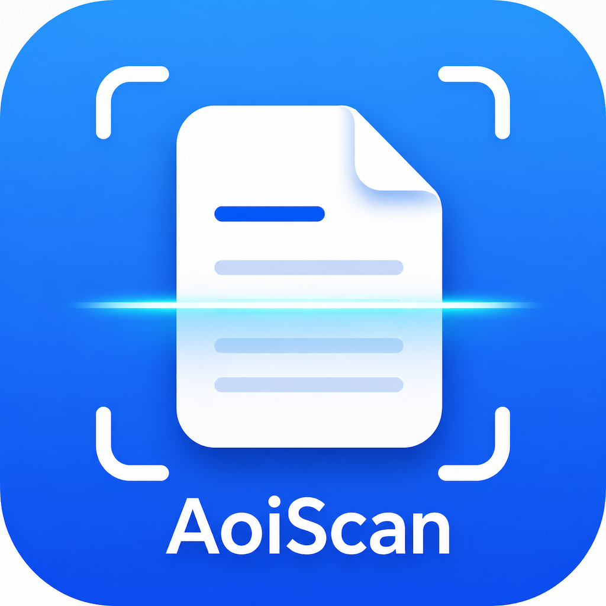

# AoiScan

<p align="center">
  
</p>

<p align="center">
  <b>A privacy-focused, offline-first document scanner for iOS.</b>
</p>

AoiScan is an open-source iOS document scanner built around **privacy, local processing, and practical image quality**. It combines Apple-native camera, computer-vision, OCR, and document frameworks to capture, improve, recognize, organize, and export documents without requiring a cloud processing service.

> AoiScan is under active development and limited TestFlight beta testing. Image-quality algorithms and thresholds may continue to change as more real-device diagnostics are collected.

---

## Highlights

### Capture and editing

- Single-page and multi-page camera capture
- Automatic document detection and perspective correction
- Manual crop adjustment, rotation, zoom, and positioning
- Original, Smart, and black-and-white document filters
- Immediate post-shutter preview
- Local document storage and renaming

### Smart image processing

- Document-aware enhancement for lighting, background, color retention, and regional sharpness
- OCR-assisted quality evaluation for selecting useful enhancements
- Fast paths for normal and dense-text pages
- Visual preflight checks that can stop expensive OCR comparisons when a candidate is unlikely to improve the page
- Conservative recovery processing for pages with strong quality problems
- Small-text and regional-clarity risk analysis

### OCR and search

- On-device text recognition using Apple Vision
- Editable recognized text
- Copy and share recognized text
- Multi-page OCR navigation
- Local full-text document search
- Separate OCR profiles for user text, search indexing, quality evaluation, and recovery comparison

### Export

- PDF generation and sharing
- Microsoft Word-compatible DOCX export
- Sharing through the standard iOS share sheet

### Privacy and diagnostics

- Offline-first architecture
- No automatic upload of scanned documents
- Local document, enhancement, OCR, and search processing
- In-app privacy information
- Reviewable and exportable diagnostic logs
- Diagnostic logs are designed not to contain scanned images, recognized document text, document contents, or user file names

---

## Latest development progress — August 14, 2026

### Faster Smart enhancement convergence

The Smart enhancement pipeline now avoids unnecessary recovery and repeated precision OCR for ordinary pages. Dense-text pages can keep an already measured baseline Smart result, while strong-problem candidates pass a lower-cost visual preflight before an additional OCR comparison is allowed to run.

The goal is to preserve useful document quality while reducing avoidable processing after capture.

### Capture buffer and best-frame selection

A first-stage capture buffer now samples a small number of recent camera frames before the shutter is pressed. At capture time, the pipeline can evaluate:

- Top, middle, and bottom sharpness
- Overall sharpness and regional balance
- Exposure quality
- Document coverage
- Corner stability
- Resolution eligibility

The formal high-resolution photo remains the default. A buffered frame is eligible only when it meets conservative resolution, stability, exposure, and no-regional-regression requirements and provides a meaningful quality improvement.

Low-resolution or incomplete buffer data is rejected early, so it cannot reduce final image quality or silently supply unsafe crop geometry.

### Color-temperature diagnostics

AoiScan can classify captured lighting as neutral, warm, cool, or uncertain and record confidence and color measurements in privacy-safe diagnostics.

This phase is **diagnostic only**: it does not automatically apply white-balance correction or alter the scanned image.

### Frame-fusion feasibility diagnostics

The project can evaluate whether buffered frames contain stable, complementary regional detail that may justify future multi-frame fusion work. This is currently a feasibility and diagnostics feature, not a production image-fusion promise.

### Verification

The latest capture-buffer and Smart-pipeline work has been compiled and linked successfully against the iPhoneOS SDK. Real-device testing and threshold tuning remain ongoing.

---

## Technology

AoiScan currently uses:

- Swift and SwiftUI
- AVFoundation
- Vision
- Core Image
- PDFKit
- Core Data
- UIKit where required for camera, imaging, and export workflows

Technologies being evaluated for future work include Core ML and OpenCV, where they can add meaningful on-device capability without weakening the privacy model.

---

## Development status

AoiScan is actively developed and tested through a limited TestFlight beta.

Current priorities include:

- Validating capture-buffer behavior across more iPhone models
- Improving document-edge and crop stability
- Tuning Smart enhancement speed and quality thresholds
- Improving colored-paper and mixed-light handling
- Expanding privacy-safe diagnostics
- Optimizing OCR and multi-page workflows
- Evaluating whether regional multi-frame fusion is worthwhile

---

## Roadmap

### Version 1.0

- [x] Single-page and multi-page document capture
- [x] Automatic document detection
- [x] Perspective correction and manual crop adjustment
- [x] Original, Smart, and black-and-white filters
- [x] Local document storage and renaming
- [x] PDF generation and sharing
- [x] DOCX export
- [x] On-device OCR and editable recognized text
- [x] Local OCR search
- [x] Privacy-safe diagnostic logs
- [x] In-app privacy information
- [x] Limited TestFlight beta testing
- [x] Smart enhancement quality routing and visual early-stop checks
- [x] Capture-buffer and conservative best-frame selection foundation
- [x] Color-temperature diagnostics
- [ ] Broader real-device validation and threshold tuning
- [ ] Additional colored-document detection improvements
- [ ] Additional scanning stability improvements

### Future development

- [ ] Advanced shadow removal and noise reduction
- [ ] PDF merge, split, and page management
- [ ] Local AI document analysis and organization
- [ ] Improved book-page detection
- [ ] Optional left/right book-page separation
- [ ] Regional multi-frame fusion, if diagnostics demonstrate a reliable benefit

---

## TestFlight and feedback

AoiScan is available to a limited number of TestFlight beta testers. To ask about testing access or report a problem, open a GitHub Issue.

Feedback is especially useful for:

- Device model and iOS version
- Document type, paper color, and lighting conditions
- Edge-detection and crop accuracy
- Smart-filter quality and processing time
- OCR accuracy
- Multi-page workflows
- Performance and stability
- Exported diagnostic logs, when available

Do not attach screenshots that contain private or sensitive document information.

---

## Development

### Requirements

- macOS
- Xcode
- iOS 17 or later
- A physical iOS device is recommended for camera and performance testing

### Clone and open

```bash
git clone https://github.com/aoineko00-droid/AoiScan.git
cd AoiScan
open AoiScan.xcodeproj
```

Select a compatible iOS device in Xcode, then build and run the application.

---

## Privacy

AoiScan is designed as an offline-first application. Scanned documents and recognized text are processed locally, and the app does not automatically upload document contents to an external processing service.

Diagnostics are intended to describe pipeline decisions, timing, quality measurements, and failure reasons without embedding scanned images or recognized document text.

---

## Contributing

Bug reports, testing feedback, suggestions, and focused code contributions are welcome. When opening an issue, include reproducible steps and relevant non-sensitive diagnostics whenever possible.

---

## License

See [LICENSE](LICENSE) for license information.

